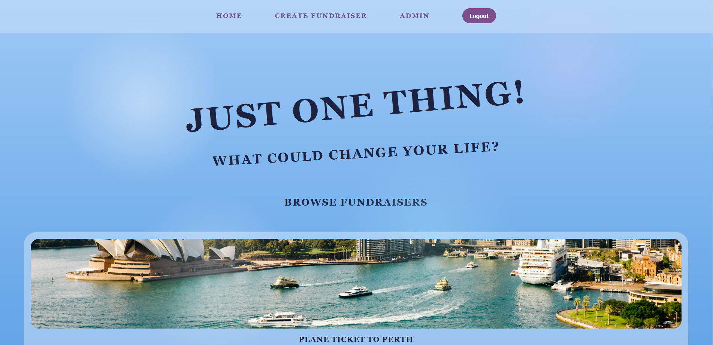
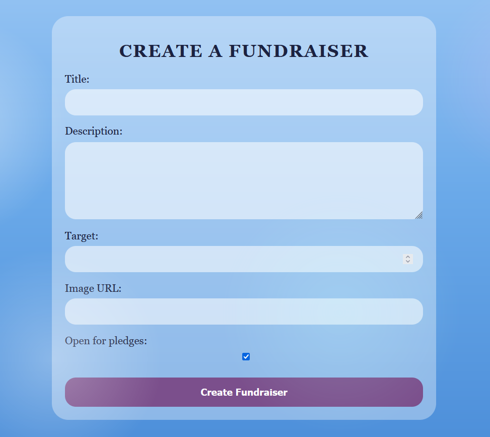
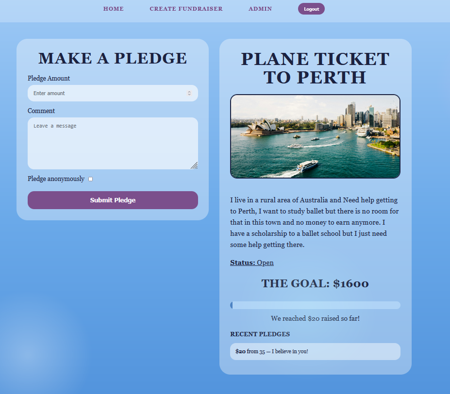

# Just One Thing!

A crowdfunding platform designed to help people achieve **one meaningful goal** that could change their life.

---

## 🔗 Live Project
**Frontend:**  
https://glittery-mochi-8e44c2.netlify.app  

**Backend API:**  
https://crowdfunding-ijustneedonething-06a0f674c900.herokuapp.com  

---

## Target Audience
People who need support for a **single life-changing opportunity**, such as:
- Travel for education
- Career opportunities
- Personal development
- Relocation or fresh starts

---

## Features

### User Accounts
- Sign up
- Log in
- Token authentication
- Staff/admin users

### Fundraisers
- Create fundraiser (logged-in users only)
- Includes:
  - Title
  - Description
  - Image
  - Target amount
  - Open/closed status
  - Created date
- Fundraisers require **admin approval** before appearing

### Pledges
- Logged-in users can pledge
- Includes:
  - Amount
  - Comment
  - Anonymous option
- Linked to both fundraiser and user

### Permissions
- Only logged-in users can:
  - Create fundraisers
- Admin users can:
  - Approve or reject fundraisers

---

## Tech Stack

**Frontend**
- React (Vite)
- React Router
- CSS

**Backend**
- Django Rest Framework
- Token Authentication
- PostgreSQL (Heroku)

---

## Screenshots

### Homepage

### Create Fundraiser Page

### Fundraiser with Pledges

